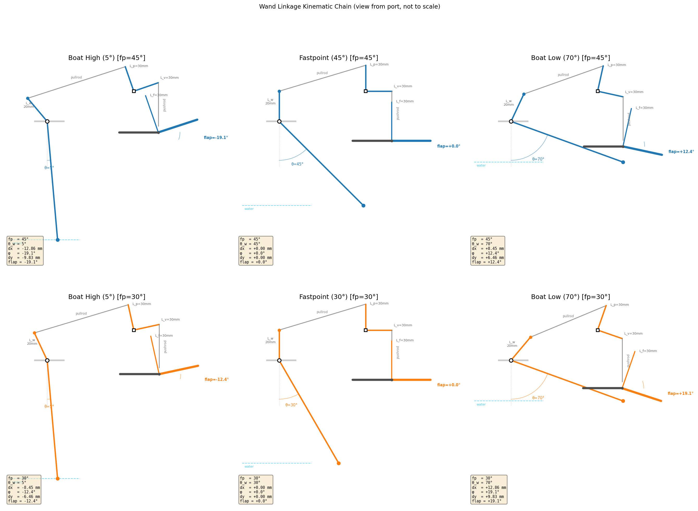
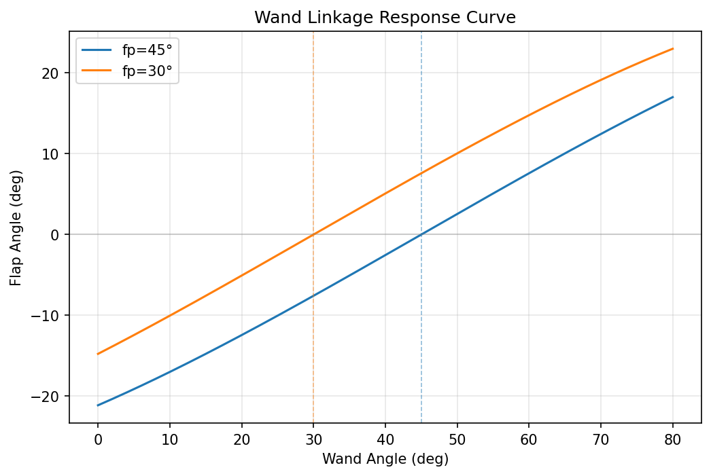
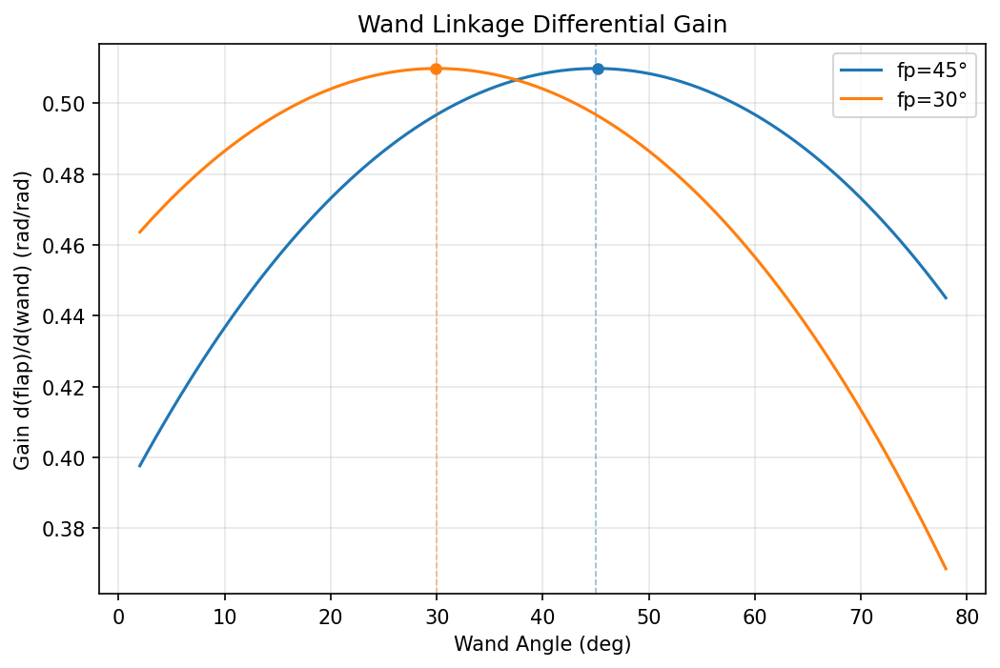
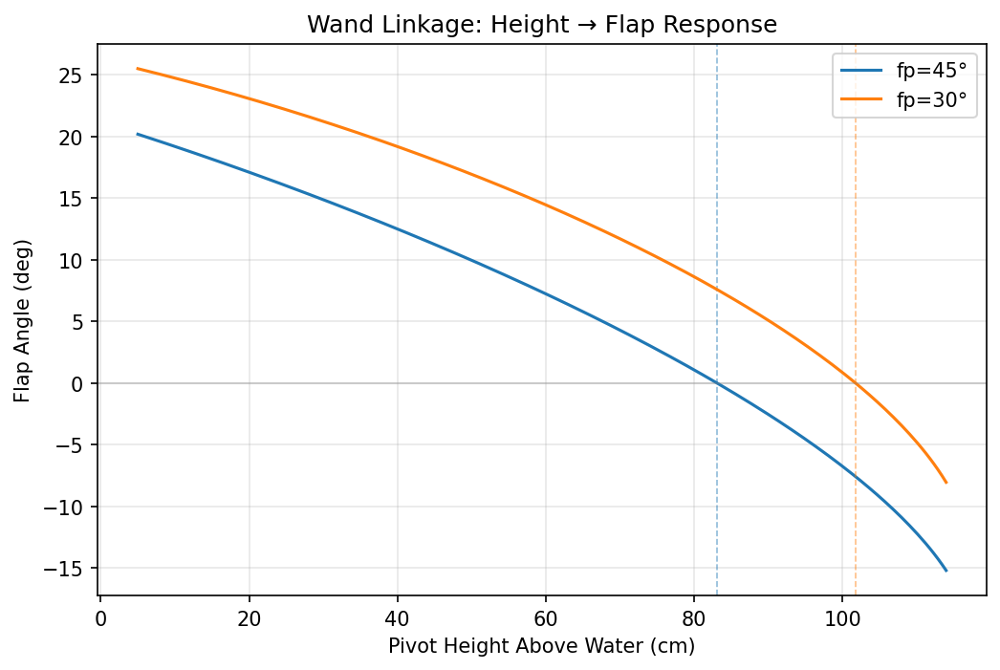
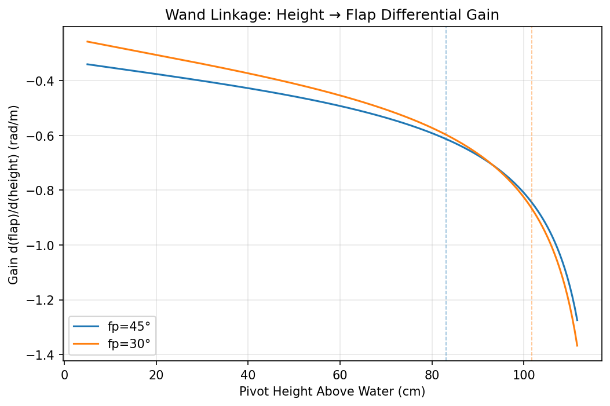

# Wand Linkage Kinematics

The wand is a passive ride height control system on Moth sailboats. A long arm
pivots at the bowsprit, its tip touching the water surface. As ride height
changes, the wand angle changes, mechanically driving the main foil flap
through a kinematic linkage.



## Kinematic Chain Overview

```
wand angle (θ_w)
    │
    ▼
┌──────────┐   pullrod_dx   ┌─────────┐   pushrod_dy   ┌───────────┐
│ Wand     │ ─────────────► │ Bell-   │ ─────────────► │ Flap      │
│ Lever    │                │ crank   │                │ Lever     │
└──────────┘                └─────────┘                └───────────┘
    │                           │                           │
    ▼                           ▼                           ▼
 dx = L_w·sin(θ-fp)      φ = arcsin(dx/L_p)      flap = arcsin(dy/L_f)
                          dy = L_v·[cos(α-φ)-cos(α)]
```

Five stages, each converting one mechanical quantity to the next:

| Stage | Input | Output | Component |
|-------|-------|--------|-----------|
| 1 | Wand angle θ_w | Pullrod displacement dx | Wand lever |
| 2 | dx | Aft pullrod displacement dx' | Gearing ratio |
| 3 | dx' | Bellcrank rotation φ | Bellcrank input arm |
| 4 | φ | Pushrod displacement dy | Bellcrank output arm |
| 5 | dy | Flap angle | Flap lever |

---

## Stage 1: Wand Lever

The wand lever is a short arm extending above the wand pivot, offset from the
wand by the fastpoint angle. When the wand is at the fastpoint angle, the lever
is vertical (straight up) and the pullrod displacement is zero.

```
        Lever (L_w)
         ╱                  ← tilted when θ_w ≠ fastpoint
        ╱
  ─────●───── bowsprit      ← pivot (●)
      ╱╲
     ╱  ╲
    ╱    ╲                  ← wand at angle θ_w from vertical
   ╱      ╲
  ╱     θ_w ╲
 ●            │
wand tip      │ vertical
              │ reference
```

The lever angle from vertical is `(θ_w - fastpoint)`. The horizontal
displacement of the lever tip (= pullrod displacement) is:

$$
\text{pullrod\_dx} = L_w \cdot \sin(\theta_w - \theta_{fp}) + \text{offset}
$$

where:
- **L_w** = wand lever arm length (default: 20 mm)
- **θ_fp** = fastpoint angle (default: 45° from vertical)
- **offset** = ride height adjuster offset (default: 0)

**Key behavior:**
- At θ_w = θ_fp: dx = 0 (lever vertical, no displacement)
- At θ_w < θ_fp (boat high): dx < 0 (lever tilted aft, pullrod pulled forward)
- At θ_w > θ_fp (boat low): dx > 0 (lever tilted forward, pullrod pushed aft)

**Why sin(θ - fp) and not sin(θ) - sin(fp)?**

The lever is not collinear with the wand. It is offset from the wand by exactly
the fastpoint angle, so when the wand is at the fastpoint, the lever is
vertical. This means the lever's angle from vertical is `(θ_w - fastpoint)`,
and the horizontal displacement of its tip is `L_w · sin(θ_w - fastpoint)`.

---

## Stage 2: Gearing

The gearing rod reduces the wand lever displacement before the bellcrank. The
rod is 170 mm long; the hull pullrod (input) attaches to the full length of the
rod, and the bellcrank pullrod (output) taps off at an adjustable point along
the rod (default: 130 mm). The output displacement is a fraction of the input:

$$
\text{gearing\_ratio} = \frac{\text{tap\_position}}{\text{rod\_length}} = \frac{130}{170} \approx 0.765
$$

Adjustable range: 100/170 ≈ 0.588 to 150/170 ≈ 0.882.

$$
\text{aft\_pullrod\_dx} = \text{pullrod\_dx} \times \text{gearing\_ratio}
$$

---

## Stage 3: Bellcrank Input (Pullrod → Rotation)

The bellcrank converts horizontal pullrod displacement into rotation. The input
arm extends upward from the bellcrank pivot, and the pullrod connects to its tip.

```
               ┌─── input arm tip (pullrod attaches here)
               │
               │  L_p (input arm)
               │
      ─────────■──────────  bellcrank output arm (L_v, horizontal at rest)
            pivot
```

As the pullrod pushes the input arm tip horizontally by dx, the bellcrank
rotates by angle φ:

$$
\phi = \arcsin\!\left(\frac{\text{aft\_pullrod\_dx}}{L_p}\right)
$$

where:
- **L_p** = bellcrank input arm length (default: 30 mm)
- φ > 0 when pullrod pushes aft (boat low)
- φ < 0 when pullrod pulls forward (boat high)

**Saturation:** The bellcrank saturates when |dx| ≥ L_p (arcsin argument
reaches ±1). With default parameters, the max |dx| is L_w × gearing =
20 × 0.765 ≈ 15.3 mm (at θ_w - fp = 90°), giving dx/L_p = 0.51 — well
within the linear range of arcsin. The bellcrank never saturates in normal
operation.

---

## Stage 4: Bellcrank Output (Rotation → Pushrod)

The output arm extends horizontally from the bellcrank pivot, at angle α
(bellcrank angle) from the input arm. As the bellcrank rotates by φ, the output
arm tip traces a circular arc. The pushrod displacement is the component of
this arc along the pushrod axis.

```
  At rest (φ = 0):              Rotated (φ > 0):

     │ input arm                    ╱ input arm
     │                             ╱
     ■──────── output arm      ───■─────╲ output arm
  pivot     (horizontal)       pivot     ╲  (tilted down)
                                          │
                                          ▼ pushrod pushes down
```

General formula for the pushrod displacement:

$$
\text{pushrod\_dy} = L_v \cdot \left[\cos(\alpha - \phi) - \cos(\alpha)\right]
$$

where:
- **L_v** = bellcrank output arm length (default: 30 mm)
- **α** = angle between bellcrank arms (default: 90°)

**Special case α = 90° (default):**

$$
\text{pushrod\_dy} = L_v \cdot \sin(\phi)
$$

since cos(90° - φ) = sin(φ) and cos(90°) = 0.

This simplifies the bellcrank to a **linear passthrough** when L_p = L_v:

$$
\text{pushrod\_dy} = L_v \cdot \sin\!\left(\arcsin\!\left(\frac{dx}{L_p}\right)\right) = \frac{L_v}{L_p} \cdot dx
$$

With equal arms (L_p = L_v = 30 mm): pushrod_dy = dx. The bellcrank just
redirects horizontal motion to vertical motion with no scaling or nonlinearity.

**Non-90° bellcrank angles** introduce geometric nonlinearity through the
cos(α - φ) - cos(α) term, which can increase or decrease gain asymmetry.

---

## Stage 5: Flap Lever

The pushrod pushes vertically on a lever arm attached to the flap hinge. The
lever converts linear pushrod displacement to flap rotation.

```
          │ pushrod (vertical)
          │
          ▼
  ────────●─────────── foil
     flap  ╲  hinge
      lever ╲
     (L_f)   ╲
               ╲ flap (deflected trailing edge)
```

$$
\text{flap\_angle} = \arcsin\!\left(\frac{\text{pushrod\_dy}}{L_f}\right)
$$

where:
- **L_f** = flap lever arm length (default: 30 mm)
- Positive flap angle = trailing edge down = more lift
- Negative flap angle = trailing edge up = less lift

---

## Complete Transfer Function

Substituting all stages (with α = 90°, L_p = L_v):

$$
\text{flap} = \arcsin\!\left(\frac{L_w \cdot g}{L_f} \cdot \sin(\theta_w - \theta_{fp})\right)
$$

where g is the gearing ratio. With default parameters (L_w = 20 mm,
g ≈ 0.765, L_f = 30 mm):

$$
\text{flap} = \arcsin\!\left(0.510 \cdot \sin(\theta_w - 45°)\right)
$$

Since the argument to arcsin never exceeds ~0.51, the arcsin is nearly linear
throughout the operating range and the response is approximately:

$$
\text{flap} \approx 0.510 \cdot \sin(\theta_w - 45°) \quad \text{(small argument approximation)}
$$

---

## Gain (Sensitivity)

The differential gain d(flap)/d(θ_w) measures how sensitive the flap is to
wand angle changes:

$$
\frac{d(\text{flap})}{d\theta_w} = \frac{\frac{L_w}{L_f} \cdot \cos(\theta_w - \theta_{fp})}{\sqrt{1 - \left(\frac{L_w}{L_f}\right)^2 \sin^2(\theta_w - \theta_{fp})}}
$$

**At the fastpoint (θ_w = θ_fp):**

$$
\text{gain} = \frac{L_w \cdot g}{L_f} = \frac{20 \times 0.765}{30} = 0.510 \text{ rad/rad}
$$

This is the peak gain. At all other angles, cos(θ_w - θ_fp) < 1 reduces the
gain, while the 1/√(1-x²) factor from arcsin slightly amplifies it. With
L_w·g/L_f ≈ 0.51, the arcsin amplification is modest, so the gain curve is
dominated by the cosine roll-off.

| Wand Angle | θ_w - fp | Gain (rad/rad) | Relative to Peak |
|:----------:|:--------:|:--------------:|:----------------:|
| 5° | -40° | 0.413 | 81% |
| 45° (fp) | 0° | 0.510 | 100% |
| 50° | +5° | 0.509 | 100% |
| 70° | +25° | 0.473 | 93% |




---

## Height → Flap Mapping

The wand tip touches the water surface, so ride height (pivot height above water)
directly determines the wand angle via geometry: θ_w = arccos(h/L), where h is
the pivot height above water and L is the wand length. This gives the end-to-end
mapping from water surface height to flap angle.

**Height response:** As the boat rises (h increases), the wand tilts toward
vertical, the lever moves aft, and the flap deflects up (less lift). As the boat
sinks (h decreases), the wand tilts forward and the flap deflects down (more
lift).

**Height gain:** The differential gain d(flap)/d(height) measures sensitivity to
ride height changes. It combines the wand-angle gain with the geometric factor
d(θ_w)/d(h) = -1/(L√(1-(h/L)²)), which is largest when h is small (boat low, wand
horizontal) and smallest when h approaches L (boat high, wand vertical).




---

## Default Parameters

Based on Bieker Moth V3 measurements.

| Parameter | Symbol | Default | Description |
|-----------|--------|---------|-------------|
| Wand lever | L_w | 20 mm | Lever arm above pivot |
| Fastpoint | θ_fp | 45° | Peak gain / zero-flap wand angle |
| Bellcrank input | L_p | 30 mm | Bellcrank input arm length |
| Bellcrank output | L_v | 30 mm | Bellcrank output arm length |
| Bellcrank angle | α | 90° | Angle between bellcrank arms |
| Flap lever | L_f | 30 mm | Flap hinge lever arm length |
| Gearing rod length | — | 170 mm | Total gearing rod length |
| Gearing rod tap | — | 130 mm | Output tap position (adjustable 100–150 mm) |
| Gearing ratio | — | ≈ 0.765 | tap/length = 130/170 |
| Pullrod offset | — | 0 mm | Ride height adjuster offset |
| Wand length | — | 1175 mm | Pivot to float (adjustable 950–1400 mm) |

---

## Physical Mapping Summary

| Condition | Wand Angle | Lever | Pullrod | Bellcrank | Pushrod | Flap |
|-----------|:----------:|:-----:|:-------:|:---------:|:-------:|:----:|
| Boat HIGH | Small (5°) | Tilted aft | Pulled fwd (dx < 0) | Rotated CCW (φ < 0) | Pushed up (dy < 0) | TE up (less lift) |
| At fastpoint | 45° | Vertical | Zero | Zero | Zero | Zero |
| Boat LOW | Large (70°) | Tilted fwd | Pushed aft (dx > 0) | Rotated CW (φ > 0) | Pushed down (dy > 0) | TE down (more lift) |

This creates **negative feedback**: when the boat rises too high, the flap
reduces lift; when the boat drops too low, the flap increases lift. The system
passively regulates ride height around the fastpoint.

---

## Implementation

- **Kinematic model:** `fmd.simulator.components.moth_wand.WandLinkage`
- **Visualization script:** `scripts/wand_gain_curve.py` (generates 5 plots including
  height→flap response and gain)
- **Wand angle from state:** `wand_angle_from_state()` computes θ_w from
  Moth3D state (pos_d, pitch) using the pivot position and wand length

To regenerate the plots: `uv run python scripts/wand_gain_curve.py`
